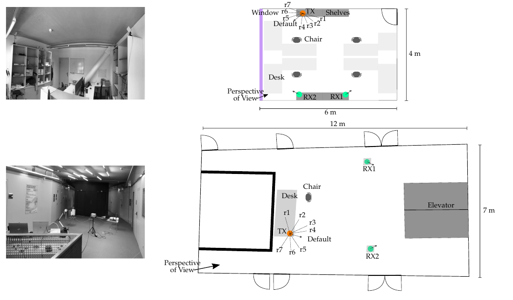
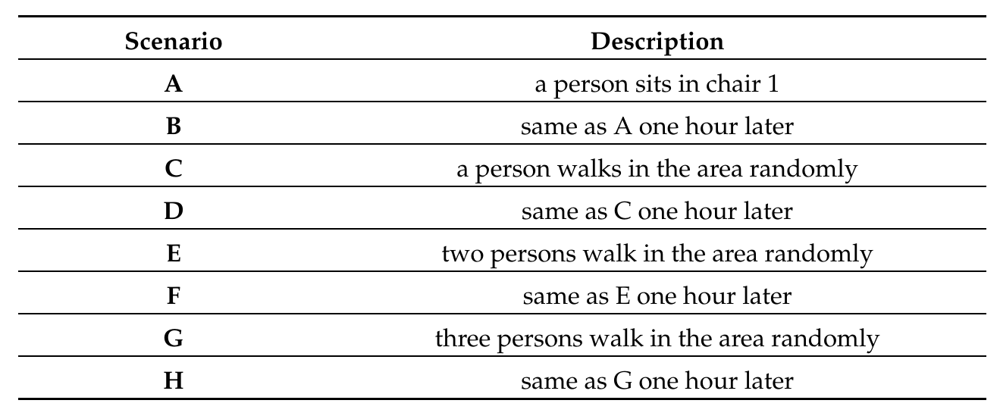

# Physical-Tamper-Attack-Detection strucutred dataset
This repo provides a structured dataset of OFDM CSI estimates in two environments (office and hall) each in different scenarios acquired with a software-defined radio and the Gnuradio OFDM project (https://github.com/rwth-ti/gr-ofdm). The parameters and scenarios were selected as described in the following.

## Acquisition
The setup consists of two receivers, each equipped with a single antenna and one transmitter, also equipped with a single antenna. As the tamper attack, we considered a rotation of the transmitter compared to its default orientation.

## OFDM System
The transmitter and receiver nodes were composed of a host computer connected to a USRP X310 equipped with a directional antenna. In the system, data were exchanged among nodes with a frame structure. Each frame consisted of nine data OFDM symbols and three preamble symbols. In the frequency domain, each symbol contained 200 data subcarriers, 48 null subcarriers, and 8 pilot subcarriers for a channel bandwidth of 25 MHz. Each OFDM symbol duration consisted of a 10.24&#181;s IFFT period followed by a 1.25 &#181;s guard interval. The carrier frequency was set to 2.55 GHz. The channel was estimated based on one preamble symbol with a least-squares approach.

## Environment
As seen in the figure above, we have two distinct environments: an office (top) and a hall (bottom). The transmitter (indicated by TX) and two receivers (indicated by RX1 and RX2) were placed on the top of shelves with a 230 cm elevation in the office and desks with a 140 cm elevation in the hall environment. To have physical tamper attacks and tamper-free scenarios in the estimates, we took into account eight different antenna orientations, including the tamper-free default orientation and rotations r1, r2,..., r7.
Since discriminating between environmental changes and physical tamper attacks is the key challenge in the attack detection problem, we considered eight scenarios for the tamper-free default orientation (see below). In these eight scenarios, typical situations in an office and a hall were considered in which small-scale (scenarios A and B) and large-scale (scenarios C to H) movements of persons appear, which introduce variations in the CSI. 

## Datasets
The filename of each dataset indicates environment_orientation_scenario_Receiver number in order. In these files, the number of rows indicates the number of packets that were captured and the number of columns shows the number of subcarriers which is 208 in this work. The file format is .float and can be easily convert to an excel file (an example python file was uploaded in the office directory).

### Environments
* office: A congested room with chairs, tables and things mounted to the walls.
* hall: A narrow corridor with flat uncongested walls which are present in many public buildings.

## How to use our datasets
All data sets are stored as a binary file. To load a specific dataset you can use like the file uploaded in the office directory.

## Check also our paper
1. https://ieeexplore.ieee.org/abstract/document/9403404

## Authors
Eshagh Dehmollaian 

Institute for Communications Engineering and RF-Systems 
https://www.jku.at/institut-fuer-nachrichtentechnik-und-hochfrequenzsysteme/
